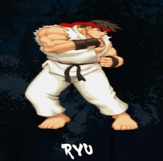

# Street Fighter

Minha versão da interface do Street Fighter, um jogo antigo que fez parte da minha infancia.

A primeira vez que joguei este jogo foi em um PlayStation 1 em meados de 2005, e foi a partir dele que comecei a me interessar por tecnologia e afins.

Street Fighter é um jogo de luta com diversos personagens. Na presente versão, apesar de existirem outros, os personagens que utilizei foram:

Ryu, Chun Li, Guile, Ken, Zangief e Sakura

[]

## Tecnologias utilizadas

- HTML
- CSS
- JS

## Coisas que aprendi

Com este projeto aprendi a redimensionar imagens e gifs com o GIMP, consegui ter uma noção melhor de como utilizar flexbox, posicionamentos, responsividade e aprendi a mexer com áudio no JS.

## Dificuldades que encontrei

Durante o projeto, decidi mexer com áudio, para colocar uma música tema do Street Fighter enquanto os usuários escolhem seu personagem. Porém os navegadores não permitem que o áudio toque automaticamente, sem que o usuário interaja com o DOM e o "mouseenter" que seria passar o mouse, não conta como interação, então o áudio não tocava, nem mesmo utilizando "autoplay".

 Pra resolver isso e dar mais possibilidades, eu criei outra tela, para o usuário escolher a modalidade "multplayer" ou "contra Máquina", somente assim, a musica toca automaticamente. 
 
 Depois fiquei com medo de que a musica tocando em loop fizesse ficar enjoativo a experiência do usuário, então coloquei os controles de audio, para pausar a musica sempre que o usuário quiser.